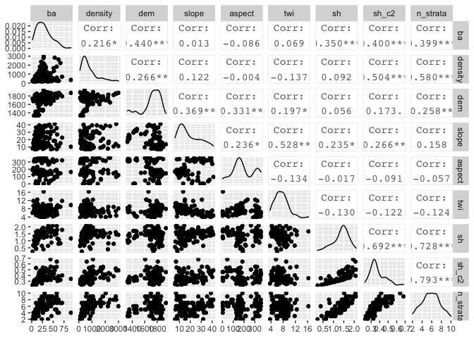
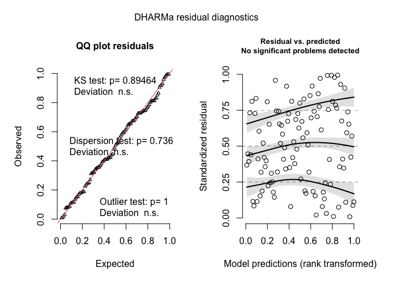
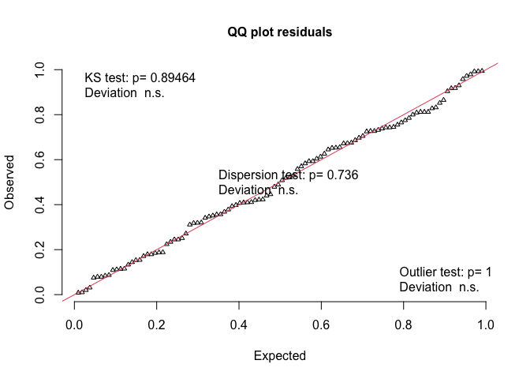
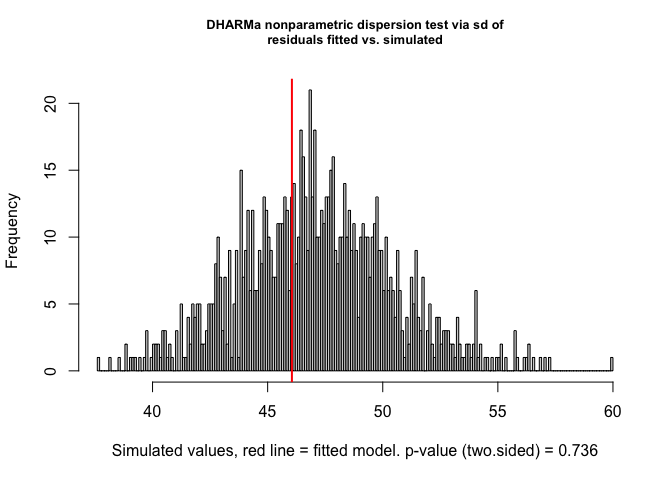
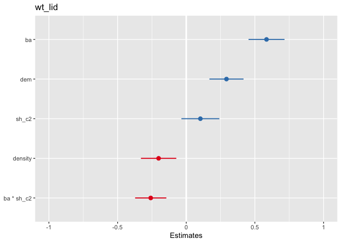
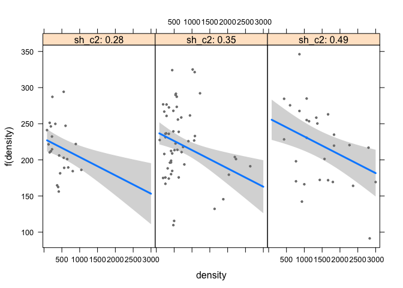
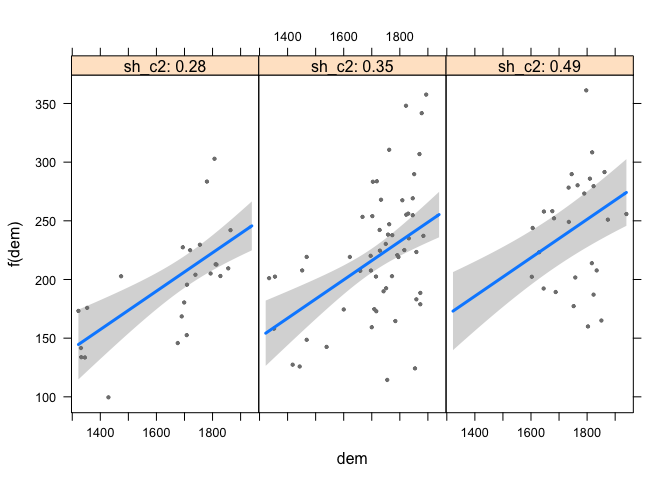
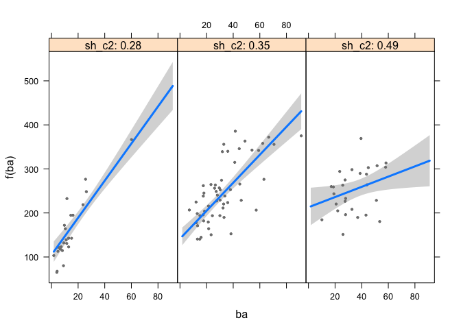
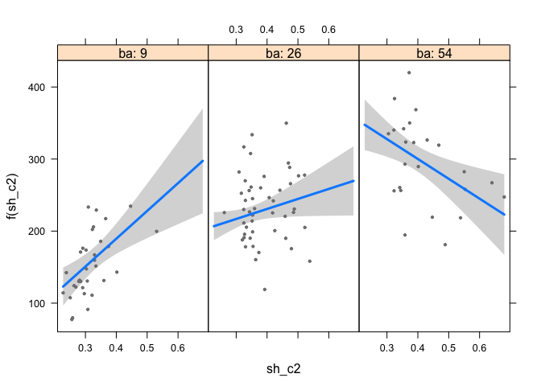

    source(here::here("load_pkgs.R"))

Read data
=========

    # field data 
    biomass_field <- read_csv(here::here("data/biomass_plot.csv"), col_types = cols()) %>% 
      dplyr::select(code, h_mean, dbh_mean, n_tree, ba, density)
    topo <- read_csv(here::here("data/topo_plots.csv"), col_types = cols()) 
    shanon <- read_csv(here::here("data/shannon_str.csv"), col_types = cols())

    biomass <- read_csv(here::here("data/compara_lidar_field.csv"), col_types = cols()) %>% 
      dplyr::select(id_plot, code, ws, wb27, wr, wb2, wr_lid, w2_lid, w27_lid, ws_lid, wt_lid)

    df <- biomass_field %>% 
      inner_join(topo, by = "code") %>% 
      inner_join(shanon, by = "code") %>% 
      inner_join(biomass, by = "code") %>%
      filter(!is.na(wt_lid)) %>% 
      filter(code != "DIL2") # Ojo tras analizar todo el modelado he visto que hay un error en DIL2, así que lo eliminamos (era un outlier detectado con DHARMa)

Explore data
============

Explore relationships
---------------------

    df %>% dplyr::select(df, wt_lid, ba, density, dem, slope, aspect, twi, sh_c2, n_strata) %>% 
      pivot_longer(cols = ba:n_strata, names_to = "variables") %>% 
      ggplot(rela, aes(y=wt_lid, x = value)) + 
      geom_point() + geom_smooth() + 
      facet_wrap(~variables, scales = "free_x")

Colinealidad
------------

    dfs <- df %>% 
      dplyr::select(code, wt_lid, ba,density, dem, slope, aspect, twi, sh, sh_c2, n_strata) 

    ggpairs(dfs, columns = 3:11) 

### GLM

    # Scalamos los datos
    scale2 <- function(x, na.rm = FALSE) (x - mean(x, na.rm = na.rm)) / sd(x, na.rm)
    df_scaled <- dfs %>% 
      mutate_at(c("ba", "density", "dem", "slope", "aspect", "twi", "sh", "sh_c2", "n_strata"), ~scale2(.x, na.rm = TRUE)) %>% 
      filter(!is.na(wt_lid))

    ## mutate_at: changed 106 values (100%) of 'ba' (0 new NA)

    ##            changed 106 values (100%) of 'density' (0 new NA)

    ##            changed 106 values (100%) of 'dem' (0 new NA)

    ##            changed 106 values (100%) of 'slope' (0 new NA)

    ##            changed 106 values (100%) of 'aspect' (0 new NA)

    ##            changed 106 values (100%) of 'twi' (0 new NA)

    ##            changed 106 values (100%) of 'sh' (0 new NA)

    ##            changed 106 values (100%) of 'sh_c2' (0 new NA)

    ##            changed 106 values (100%) of 'n_strata' (0 new NA)

    ## filter: no rows removed

#### Modelo GLM

-   Buscar el mejor modelo basado en BIC

<!-- -->

    # Datos no scalados 
    m0 <- glm(wt_lid ~ ba + density + dem + slope + aspect + twi + sh_c2 + n_strata, 
              family = "gaussian", data = df)

    # Buscar el mejor modelo
    ### AIC or BIC  
    # https://rstudio-pubs-static.s3.amazonaws.com/2897_9220b21cfc0c43a396ff9abf122bb351.html

    set.seed(1234)
    select_m0 <- glmulti(wt_lid ~ ba*density*dem*twi*sh_c2, data = df,
                 level= 2,
            chunk = 1, chunks = 4,
            method = "ga",
            crit = "bic", 
            family = "gaussian", 
            marginality = TRUE,
            confsetsize = 5, 
            plotty = FALSE, report = FALSE)

    ## TASK: Genetic algorithm in the candidate set.
    ## Initialization...
    ## Algorithm started...
    ## Improvements in best and average IC have bebingo en below the specified goals.
    ## Algorithm is declared to have converged.
    ## Completed.

    summary(select_m0@objects[[1]]) 

    ## 
    ## Call:
    ## fitfunc(formula = as.formula(x), family = "gaussian", data = data)
    ## 
    ## Deviance Residuals: 
    ##      Min        1Q    Median        3Q       Max  
    ## -117.019   -31.262    -1.491    29.918   112.023  
    ## 
    ## Coefficients:
    ##               Estimate Std. Error t value Pr(>|t|)    
    ## (Intercept) -3.138e+02  6.787e+01  -4.624 1.13e-05 ***
    ## ba           8.355e+00  1.214e+00   6.884 5.19e-10 ***
    ## density     -2.533e-02  8.175e-03  -3.099  0.00252 ** 
    ## dem          1.636e-01  3.496e-02   4.680 9.02e-06 ***
    ## sh_c2        5.215e+02  1.286e+02   4.057 9.87e-05 ***
    ## ba:sh_c2    -1.472e+01  3.264e+00  -4.511 1.76e-05 ***
    ## ---
    ## Signif. codes:  0 '***' 0.001 '**' 0.01 '*' 0.05 '.' 0.1 ' ' 1
    ## 
    ## (Dispersion parameter for gaussian family taken to be 2226.999)
    ## 
    ##     Null deviance: 750845  on 105  degrees of freedom
    ## Residual deviance: 222700  on 100  degrees of freedom
    ## AIC: 1125.7
    ## 
    ## Number of Fisher Scoring iterations: 2

    # Best Model 
    m <- glm(wt_lid ~ ba + density + dem + sh_c2 + ba:sh_c2, 
              family = "gaussian", data = df)
    tabglm(m)

    ## Waiting for profiling to be done...

    ##      Variable       Beta (SE)             95% CI      P
    ## 1   Intercept -313.82 (67.87) (-446.84, -180.79) <0.001
    ## 2          ba     8.36 (1.21)      (5.98, 10.73) <0.001
    ## 3     density    -0.03 (0.01)     (-0.04, -0.01)  0.003
    ## 4         dem     0.16 (0.03)       (0.10, 0.23) <0.001
    ## 5       sh_c2 521.51 (128.55)   (269.55, 773.47) <0.001
    ## 6 ba by sh_c2   -14.72 (3.26)    (-21.12, -8.33) <0.001

    stargazer(m)

% Table created by stargazer v.5.2.2 by Marek Hlavac, Harvard
University. E-mail: hlavac at fas.harvard.edu % Date and time: Fri, Nov
20, 2020 - 13:02:42
    stargazer(m, type="html")

    ## 
    ## <table style="text-align:center"><tr><td colspan="2" style="border-bottom: 1px solid black"></td></tr><tr><td style="text-align:left"></td><td><em>Dependent variable:</em></td></tr>
    ## <tr><td></td><td colspan="1" style="border-bottom: 1px solid black"></td></tr>
    ## <tr><td style="text-align:left"></td><td>wt_lid</td></tr>
    ## <tr><td colspan="2" style="border-bottom: 1px solid black"></td></tr><tr><td style="text-align:left">ba</td><td>8.355***</td></tr>
    ## <tr><td style="text-align:left"></td><td>(1.214)</td></tr>
    ## <tr><td style="text-align:left"></td><td></td></tr>
    ## <tr><td style="text-align:left">density</td><td>-0.025***</td></tr>
    ## <tr><td style="text-align:left"></td><td>(0.008)</td></tr>
    ## <tr><td style="text-align:left"></td><td></td></tr>
    ## <tr><td style="text-align:left">dem</td><td>0.164***</td></tr>
    ## <tr><td style="text-align:left"></td><td>(0.035)</td></tr>
    ## <tr><td style="text-align:left"></td><td></td></tr>
    ## <tr><td style="text-align:left">sh_c2</td><td>521.508***</td></tr>
    ## <tr><td style="text-align:left"></td><td>(128.552)</td></tr>
    ## <tr><td style="text-align:left"></td><td></td></tr>
    ## <tr><td style="text-align:left">ba:sh_c2</td><td>-14.725***</td></tr>
    ## <tr><td style="text-align:left"></td><td>(3.264)</td></tr>
    ## <tr><td style="text-align:left"></td><td></td></tr>
    ## <tr><td style="text-align:left">Constant</td><td>-313.816***</td></tr>
    ## <tr><td style="text-align:left"></td><td>(67.869)</td></tr>
    ## <tr><td style="text-align:left"></td><td></td></tr>
    ## <tr><td colspan="2" style="border-bottom: 1px solid black"></td></tr><tr><td style="text-align:left">Observations</td><td>106</td></tr>
    ## <tr><td style="text-align:left">Log Likelihood</td><td>-556.865</td></tr>
    ## <tr><td style="text-align:left">Akaike Inf. Crit.</td><td>1,125.730</td></tr>
    ## <tr><td colspan="2" style="border-bottom: 1px solid black"></td></tr><tr><td style="text-align:left"><em>Note:</em></td><td style="text-align:right">*p<0.1; **p<0.05; ***p<0.01</td></tr>
    ## </table>

    # How many variance explained 
    (m$null.deviance - m$deviance)/m$null.deviance*100

    ## [1] 70.3401

    ## diagnostics 
    diagnosis_m <- simulateResiduals(m, seed = 123, n=1000, plot=TRUE)

    testUniformity(diagnosis_m)

    ## 
    ##  One-sample Kolmogorov-Smirnov test
    ## 
    ## data:  simulationOutput$scaledResiduals
    ## D = 0.055925, p-value = 0.8946
    ## alternative hypothesis: two-sided

    testDispersion(diagnosis_m)

    ## 
    ##  DHARMa nonparametric dispersion test via sd of residuals fitted vs.
    ##  simulated
    ## 
    ## data:  simulationOutput
    ## ratioObsSim = 0.9773, p-value = 0.736
    ## alternative hypothesis: two.sided

Predicted values GLM selected
=============================

    #devtools::install_github("cardiomoon/ggiraphExtra")
    # wt_lid ~ ba + density + dem + sh_c2 + ba:sh_c2
    plot_model(m, sort.est = TRUE, type="std2")

    ytitle <- expression(paste(W[total], " (Mg ", ha^-1,")"))
    batitle <- expression(paste("Basal Area (",m^2, " ", ha^-1,")"))
    demtitle <- "Elevation (m)"
    densitytitle <- expression(paste("Tree density (trees ", ha^-1, ")"))
    shtitle <- "Shannon structural diversity index"

    # pdf(here::here("/fig/glm_wtotal.pdf"), width=7, height = 7)
    png(here::here("/fig/glm_wtotal.png"), width=3000, height=3000, res=500, pointsize = 12)
    par(mfrow=c(2,2),
        mar = c(4,4.5,2,2))
    visreg(m, ylab = ytitle, "ba", xlab = batitle)

    ## Warning:   Note that you are attempting to plot a 'main effect' in a model that contains an
    ##   interaction.  This is potentially misleading; you may wish to consider using the 'by'
    ##   argument.

    ## Conditions used in construction of plot
    ## density: 572.9577
    ## dem: 1750.5
    ## sh_c2: 0.3516314

    visreg(m, ylab = ytitle, "dem", xlab = demtitle)

    ## Warning:   Note that you are attempting to plot a 'main effect' in a model that contains an
    ##   interaction.  This is potentially misleading; you may wish to consider using the 'by'
    ##   argument.

    ## Conditions used in construction of plot
    ## ba: 26.08105
    ## density: 572.9577
    ## sh_c2: 0.3516314

    visreg(m, ylab = ytitle, "density", xlab = densitytitle)

    ## Warning:   Note that you are attempting to plot a 'main effect' in a model that contains an
    ##   interaction.  This is potentially misleading; you may wish to consider using the 'by'
    ##   argument.

    ## Conditions used in construction of plot
    ## ba: 26.08105
    ## dem: 1750.5
    ## sh_c2: 0.3516314

    visreg(m, ylab = ytitle, "sh_c2", xlab = shtitle)

    ## Warning:   Note that you are attempting to plot a 'main effect' in a model that contains an
    ##   interaction.  This is potentially misleading; you may wish to consider using the 'by'
    ##   argument.

    ## Conditions used in construction of plot
    ## ba: 26.08105
    ## density: 572.9577
    ## dem: 1750.5

    dev.off()

    ## quartz_off_screen 
    ##                 2

    # Plots interactions
    visreg(m, "density", by="sh_c2")

    visreg(m, "dem", by="sh_c2")

    visreg(m, "ba", by="sh_c2")

    visreg(m, "sh_c2", by="ba")

Surface responses
=================

    batitle_pers <- "\n\nBasal Area \n(m2 ha-1)"
    wt_title <- "\n\nW total \n(Mg ha-1)"

    png(here::here("/fig/glm_wtotal_surface.png"), width=1500, height=500, res=200)
    par(mfrow=c(1,3),
        mar = c(5,0,0,0))
    visreg2d(m, "dem", "ba", scale = "response", plot.type = "persp", theta = -45, phi =30,
             xlab = "\nElevation (m)", ylab = batitle_pers, zlab = wt_title,
             cex.lab = 1, cex.axis = 0.7, color = "green", shade =.4)

    visreg2d(m,  "density", "ba", scale = "response", plot.type = "persp", theta = -45, phi = 30, 
             xlab = "\n\nTree density \n(trees ha-1)", ylab = batitle_pers, zlab = wt_title,
             cex.lab = 1, cex.axis = 0.7, color = "green", shade =.4)

    visreg2d(m,   "sh_c2", "ba", scale = "response", plot.type = "persp", theta = -39, phi= 30, 
             xlab = "\n\nShannon \nstructural index ", ylab = batitle_pers, zlab = wt_title, 
             cex.lab = 1, cex.axis = 0.7, color = "green", shade =.4)
    dev.off()

    ## quartz_off_screen 
    ##                 2

    #Old codes 

    # BestGLM 
    # 
    # 
    # # Model 
    # # wt_lid ~ ba + density + dem + slope + aspect + twi + sh_c2 
    # 
    # Xy <- df %>% 
    #   dplyr::select(ba, density, dem, slope, aspect, twi, sh_c2, n_strata, wt_lid) %>% as.data.frame() %>% 
    #   filter(!is.na(wt_lid))
    # X <- Xy[,1:7]
    # y <- Xy[,8]
    # out <- summary(regsubsets(x = X, y = y, nvmax=ncol(X),
    #                           method = "exhaustive"))
    # 
    # o <- cbind(out$which, rsq = out$rsq, rss = out$rss, 
    #       adjr2 = out$adjr2, bic = out$bic)
    # 
    # 
    # mejor <- bestglm(Xy, family = gaussian, IC="AIC", TopModels = 15)
    # mejor$BestModels
    # 

    ############### Surface responses Manual
    # 
    # # BA 
    # mydata <- data.frame(ba = seq(0, 95, by = 1), dem = 1750, density = 500)
    # p0 <- predict(m0best, newdata=mydata, type = "response", se = TRUE)
    # 
    # plot(x = Xy$ba, y = Xy$wt_lid, type = "n", xlab = "Basal Area", ylab = "Wtotal")
    # points(x = Xy$ba, y = Xy$wt_lid, pch = 19, cex=0.5)
    # lines(x=mydata$ba, y = p0$fit) 
    # lines(x =mydata$ba, y = p0$fit  + 2*p0$se.fit, lty=2)
    # lines(x =mydata$ba, y = p0$fit  - 2*p0$se.fit, lty=2)
    # 
    # # DEM 
    # mydata <- data.frame(dem = seq(1300, 2000, by = 10), ba = 25, density = 500)
    # p0 <- predict(m0best, newdata=mydata, type = "response", se = TRUE)
    # 
    # plot(x = Xy$dem, y = Xy$wt_lid, type = "n", xlab = "Elevation", ylab = "Wtotal")
    # points(x = Xy$dem, y = Xy$wt_lid, pch = 19, cex=0.5)
    # lines(x=mydata$dem, y = p0$fit) 
    # lines(x =mydata$dem, y = p0$fit  + 2*p0$se.fit, lty=2)
    # lines(x =mydata$dem, y = p0$fit  - 2*p0$se.fit, lty=2)
    # 
    # 
    # # density 
    # mydata <- data.frame(dem = 1750, ba = 25, density = seq(0, 3000, by = 25))
    # p0 <- predict(m0best, newdata=mydata, type = "response", se = TRUE)
    # 
    # plot(x = Xy$density, y = Xy$wt_lid, type = "n", xlab = "Density", ylab = "Wtotal")
    # points(x = Xy$density, y = Xy$wt_lid, pch = 19, cex=0.5)
    # lines(x=mydata$density, y = p0$fit) 
    # lines(x =mydata$density, y = p0$fit  + 2*p0$se.fit, lty=2)
    # lines(x =mydata$density, y = p0$fit  - 2*p0$se.fit, lty=2)

    # 
    # # Obtener que color de sombra se utiliza 
    # sombra.col <- trellis.par.get("shade.colors")
    # ## Cambiar la transparencia del grafico 
    # sombra.col$alpha <-.3
    # ## Cambiar la paleta del sombreado
    # sombra.col$palette <- function(irr, ref,
    # height, w = 0.5) {grey(w * irr + (1 - w) * (1 - (1 - ref)^0.4))}
    # ## Set los nuevos valores de shade
    # trellis.par.set("shade.colors",sombra.col)
    # 
    # 
    # # 3d plot BA elev 
    # 
    # # Creamos un conjunto de datos para los predichos
    # nuevos.datos <- expand.grid(dem = seq(from=1300, to=2000, by=10),
    #                             ba = seq(0, 95, by = 1), density = 500)
    # # Calculamos los predichos 
    # nuevos.datos$predichos <- predict(m0best, newdata=nuevos.datos, type="response")
    # 
    # 
    # plot_elev_ba <- wireframe(predichos ~ dem * ba,
    #       data=nuevos.datos, screen= list(z=-35, x= -60), shade=T, 
    #       scales = list(arrows = TRUE),
    #       zlab = list(label = "Wt"),
    #       ylab = list(label = "BA"),
    #       xlab = list(label = "Elevation"),
    #       strip = strip.custom(bg=gray.colors(1,0.95)))
    # 
    # 
    # # 3d plot BA density 
    # 
    # # Creamos un conjunto de datos para los predichos
    # nuevos.datos <- expand.grid(dem = 1750,
    #                             ba = seq(0, 95, by = 20), 
    #                             density = seq(0, 3000, by = 100))
    # # Calculamos los predichos 
    # nuevos.datos$predichos <- predict(m0best, newdata=nuevos.datos, type="response")
    # 
    # plot_den_ba <- wireframe(predichos ~ density * ba,
    #       data=nuevos.datos, screen= list(z=-35, x= -60), shade=T, 
    #       scales = list(arrows = TRUE),
    #       zlab = list(label = "Wt"),
    #       ylab = list(label = "BA"),
    #       xlab = list(label = "Tree density"),
    #       strip = strip.custom(bg=gray.colors(1,0.95)),
    #               panel.3d.wireframe =
    #             function(x, y, z,
    #                      xlim, ylim, zlim,
    #                      xlim.scaled, ylim.scaled, zlim.scaled,
    #                      ...) {
    #               panel.3dwire(x = x, y = y, z = z,
    #                            xlim = xlim,
    #                            ylim = ylim,
    #                            zlim = zlim,
    #                            xlim.scaled = xlim.scaled,
    #                            ylim.scaled = ylim.scaled,
    #                            zlim.scaled = zlim.scaled,
    #                            col = "gray",
    #                            ...)
    #             })
    # 
    # 
    # 
    # # 3d plot elev density 
    # 
    # # Creamos un conjunto de datos para los predichos
    # nuevos.datos <- expand.grid(dem = seq(1300, 2000, by = 50), 
    #                             ba = 25,
    #                             density = seq(0, 3000, by = 50))
    # # Calculamos los predichos 
    # nuevos.datos$predichos <- predict(m0best, newdata=nuevos.datos, type="response")
    # 
    # plot_dem_den <-
    # wireframe(predichos ~ dem * density ,
    #       data=nuevos.datos, screen= list(z=-35, x= -50), shade=T, 
    #       scales = list(arrows = TRUE),
    #       zlab = list(label = "Wt"),
    #       #ylab = list(label = "BA"),
    #       #xlab = list(label = "Tree density"),
    #       strip = strip.custom(bg=gray.colors(1,0.95)),
    #       panel.3d.wireframe =
    #             function(x, y, z,
    #                      xlim, ylim, zlim,
    #                      xlim.scaled, ylim.scaled, zlim.scaled,
    #                      ...) {
    #               panel.3dwire(x = x, y = y, z = z,
    #                            xlim = xlim,
    #                            ylim = ylim,
    #                            zlim = zlim,
    #                            xlim.scaled = xlim.scaled,
    #                            ylim.scaled = ylim.scaled,
    #                            zlim.scaled = zlim.scaled,
    #                            col = "gray",
    #                            ...)
    #             })
    #
